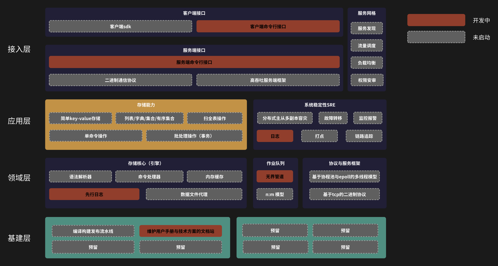

# 🌚 Eggie KV

一个简单的、支持持久化的、基于内存的key-value存储

![License][license] [![GoDoc][doc-img]][doc] [![Test Status][ci-img]][ci] [![Coverage Status][cov-img]][cov] [![Chat][chat-img]][chat] [![All Contributors][contributor-img]](#contributors)

## 安装

我保证在项目可以真正跑起来之后会回来完善这里🫡

## 快速开始

同上，我保证在项目可以真正跑起来之后会回来完善这里🫡

## 性能测试

同上，我保证在项目可以真正跑起来之后会回来完善这里🫡

## 开发状态：我们正朝着积极的目标前进！

## 参与贡献

我们欢迎稳定、高质量的贡献参与进来！我们会积极关注issue与pull-requests(PR)。
请阅读 [参与贡献](CONTRIBUTING.md) 与 [行为准则](CODE_OF_CONDUCT.md)

<!-- ALL-CONTRIBUTORS-LIST:START - Do not remove or modify this section -->
<!-- prettier-ignore-start -->
<!-- markdownlint-disable -->

<!-- markdownlint-restore -->
<!-- prettier-ignore-end -->

<!-- ALL-CONTRIBUTORS-LIST:END -->

[license]: https://img.shields.io/github/license/Trinoooo/eggie_kv
[doc-img]: https://img.shields.io/badge/reference-reference?logo=go&labelColor=gray&color=blue&link=https%3A%2F%2Fpkg.go.dev%2Fgithub.com%2FTrinoooo%2Feggie_kv
[doc]: https://pkg.go.dev/github.com/Trinoooo/eggie_kv
[ci-img]: https://github.com/Trinoooo/eggie_kv/actions/workflows/test.yaml/badge.svg
[ci]: https://github.com/Trinoooo/eggie_kv/actions/workflows/test.yaml
[cov-img]: https://codecov.io/gh/Trinoooo/eggie_kv/graph/badge.svg?token=A86TGA8XOE
[cov]: https://codecov.io/gh/Trinoooo/eggie_kv
[chat-img]: https://img.shields.io/discord/1207634458497257522?logo=discord
[chat]: https://discord.gg/nbcTFntF
[contributor-img]: https://img.shields.io/github/all-contributors/Trinoooo/eggie_kv?color=ee8449&style=flat-square
