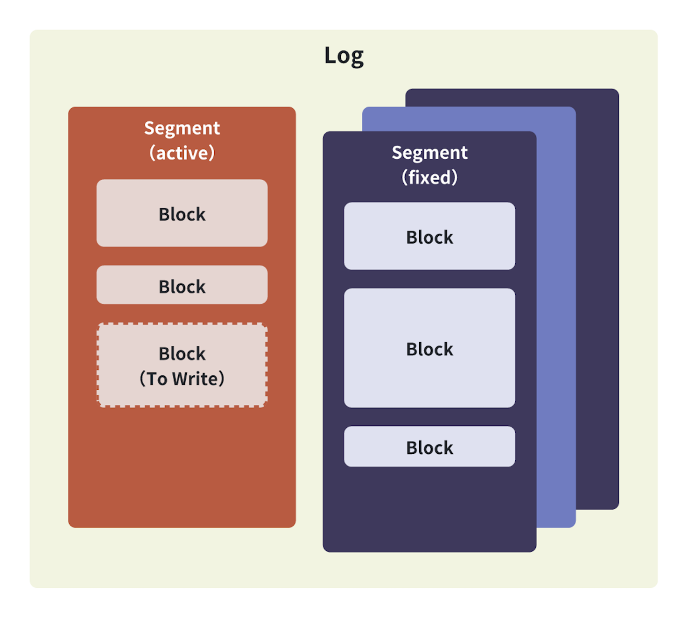

# 预写日志

## 意义

当存储核心接收到对数据记录的变更请求时不会立刻修改数据文件内容，而是将变更内容记录到**预写日志**中。  
这是因为**预写日志**将存储核心对于数据文件的随机写转化为对日志文件顺序写，从而**大幅提高写文件性能**。


## 特性

1. 支持原子写入、截断日志文件。承诺日志要么完全写入文件，要么完全不写，不会出现写入文件一半数据的情况。
2. 已经打开的日志实例会对日志目录加锁确保其他日志实例不会重入，避免预期外的错误发生。
3. 提供灵活的配置能力，包括权限、缓存容量、数据文件大小、持久化级别。

## 概念



- **_Log_**：预写日志实体，由多个 **_Segment_** 组成。**_Log_** 将 **_Segment_** 维护在指定目录下。内部通过 LRU 缓存读命中的 **_Segment_**。
- **_Segment_**：日志数据文件，由零或多个 **_Block_** 组成。为了优化写时复制（Copy-On-Write）性能以及后续可能支持的并发写日志，一个 **_Log_** 中通常有多个 **_Segment_**。
  **_Segment_** 会保证 **_Block_** 完整地存在同一个数据文件中，如果剩余容量不足以容纳下一个 **_Block_**会开启下一个 **_Segment_**。
- **_Block_**：日志记录**逻辑**实体，用于定位日志记录边界、记录完整性校验、限制 **_Log_** 下最大日志数量。

## 日志实例

### NewLog

初始化日志实例

参数：

| 字段名           | 数据类型           | 描述               |
|---------------|----------------|------------------|
| **_dirPath_** | **_string_**   | 存放日志数据文件的目录      |
| **_opts_**    | **_*Options_** | 配置选项，不传配置将设置成默认值 |

返回值：

| 字段名        | 数据类型              | 描述                                                                                                            |
|------------|-------------------|---------------------------------------------------------------------------------------------------------------|
| **_log_**  | **_*Log_**        | 日志实例                                                                                                          |
| **_errs_** | **_*errs.KvErr_** | 可能出现的错误：<br/><ul><li>**_errs.NewInvalidParamErr_** 传入的 `opts` 校验未通过，日志中有描述具体非法参数；也有可能是传入的目录路径不是一个目录</li></ul> |

示例：

```go title="使用默认配置"
package main

import "github.com/Trinoooo/eggie_kv/storage/core/ragdoll/wal"

func main() {
    dirPath := "path/to/your/wal_dir"
    // highlight-start
    log, err := wal.NewLog(dirPath, nil) // opt为空将使用默认配置
    // highlight-end
    if err != nil {
        panic(err)
    }
}
```

```go title="使用自定义配置"
package main

import (
	"github.com/Trinoooo/eggie_kv/storage/core/ragdoll/wal"
	"github.com/Trinoooo/eggie_kv/consts"
)

func main() {
    dirPath := "path/to/your/wal_dir"
    // highlight-start
    opts := wal.NewOptions().
      SetLogDirPerm(0770).
      SetDataFilePerm(0660).
      SetDataFileCacheSize(5).
      SetDataFileCapacity(int64(100 * consts.MB)).
      SetSyncMode(FullManagedSync)
    log, err := wal.NewLog(dirPath, opts)
    // highlight-end
    if err != nil {
        panic(err)
    }
}
```

### Open

打开日志  
为了避免内存泄漏，结束使用后需要显示调用 [**_Close_**](#close) 关闭日志文件

返回值：

| 字段名        | 数据类型              | 描述                                                                                                                                                                                                                                                                                                                                                                                                                                                                                                                                                                                                                                                      |
|------------|-------------------|---------------------------------------------------------------------------------------------------------------------------------------------------------------------------------------------------------------------------------------------------------------------------------------------------------------------------------------------------------------------------------------------------------------------------------------------------------------------------------------------------------------------------------------------------------------------------------------------------------------------------------------------------------|
| **_errs_** | **_*errs.KvErr_** | 可能出现的错误：<br/><ul><li>**_errs.NewFlockFileErr_** 日志数据文件目录路径已经被其他日志实例打开，此时外部应该检查这个错误并且重试其他目录路径；有小概率是因为初始化日志实例过程中出现其他错误（会在日志中输出）之后释放目录锁导致 </li><li>**_errs.NewInvalidParamErr_** 传入的 `opts` 校验未通过，日志中有描述具体非法参数；也有可能是传入的目录路径不是一个目录 </li><li>**_errs.NewMkdirErr_** 配置中目录不存在，且尝试创建目录失败 </li><li>**_errs.NewFileStatErr_** 获取目录文件信息失败 </li><li>**_errs.NewOpenFileErr_** 打开目录锁文件、数据失败 </li><li>**_errs.NewWalkDirErr_** 遍历日志目录失败，具体原因请参考日志 </li><li>**_errs.NewParseIntErr_** 解析数据文件名失败 </li><li>**_errs.NewReadFileErr_** 读取数据文件失败 </li><li>**_errs.NewCorruptErr_** 数据文件被篡改、损坏 </li><li>**_errs.NewBackgroundErr_** 这个错误不会抛出，但会出现在日志中，表示后台协程执行出错 </li></ul> |

示例：
```go
package main

import (
    "github.com/Trinoooo/eggie_kv/storage/core/ragdoll/wal"
    "github.com/Trinoooo/eggie_kv/consts"
)

func main() {
    dirPath := "path/to/your/wal_dir"
    log, err := wal.NewLog(dirPath, nil)
    if err != nil {
        panic(err)
    }

    // highlight-start
    err = log.Open()
    // highlight-end
    if err != nil {
        panic(err)
    }
}
```

### Close

关闭日志实例，释放资源

返回值：

| 字段名        | 数据类型              | 描述                                                                                                                             |
|------------|-------------------|--------------------------------------------------------------------------------------------------------------------------------|
| **_errs_** | **_*errs.KvErr_** | 可能出现的错误：<br/> <ul><li>**_errs.NewFileClosedErr_** 在日志实例或数据文件已经关闭后再次尝试关闭 </li><li>**_errs.NewFlockFileErr_** 释放目录锁失败 </li></ul> |


示例：
```go
package main

import (
    "github.com/Trinoooo/eggie_kv/storage/core/ragdoll/wal"
    "github.com/Trinoooo/eggie_kv/consts"
)

func main() {
    dirPath := "path/to/your/wal_dir"
    log, err := wal.NewLog(dirPath, nil)
    if err != nil {
        panic(err)
    }
	
    err = log.Open()
    if err != nil {
        panic(err)
    }

    // highlight-start
    err = log.Close()
    // highlight-end
    if err != nil {
        panic(err)
    }
}
```

### Write

写入日志数据

参数：

| 字段名        | 数据类型         | 描述        |
|------------|--------------|-----------|
| **_data_** | **_[]byte_** | 预期写入的日志数据 |

返回值：

| 字段名            | 数据类型              | 描述                                                                                                                                                                                                                                                                                                                                                                                                                                                                                                                                                                                                                                                                                                                                                         |
|----------------|-------------------|------------------------------------------------------------------------------------------------------------------------------------------------------------------------------------------------------------------------------------------------------------------------------------------------------------------------------------------------------------------------------------------------------------------------------------------------------------------------------------------------------------------------------------------------------------------------------------------------------------------------------------------------------------------------------------------------------------------------------------------------------------|
| **_errs_**     | **_*errs.KvErr_** | 可能出现的错误:<br/> <ul><li>**_errs.NewWalFullErr_** 日志目录触达存储上限，使用者应该主动检查该类型错误并在 [**_Truncate_**](#truncate) 后重新尝试写入，此时日志实例不会关闭，因此对日志实例的操作是安全的</li><li>**_errs.NewFileClosedErr_** 在日志实例已经关闭的情况下写入</li><li>**_errs.NewCorruptErr_** 在日志数据文件已经被破坏的情况下写入</li><li>**_errs.NewBackgroundErr_** 在日志实例后台协程执行失败的情况下写入</li><li>**_errs.NewInvalidParamErr_** 单次写入数据超过数据文件容量或写入空数据</li><li>**_errs.NewRenameFileErr_** 重命名数据文件失败</li><li>**_errs.NewParseIntErr_** 解析数据文件名失败</li><li>**_errs.NewCreateTempFileErr_** 创建临时文件失败</li><li>**_errs.NewSeekFileErr_** 重定位数据文件偏移量失败</li><li>**_errs.NewCopyFileErr_** 拷贝数据文件内容失败</li><li>**_errs.NewCloseFileErr_** 关闭数据文件失败</li><li>**_errs.NewWriteFileErr_** 写入数据文件失败</li><li>**_errs.NewSyncFileErr_** 同步数据文件到磁盘失败</li></ul> |

示例：

```go
package main

import (
  "fmt"
  "github.com/Trinoooo/eggie_kv/storage/core/ragdoll/wal"
  "github.com/Trinoooo/eggie_kv/consts"
)

func main() {
    dirPath := "path/to/your/wal_dir"
    log, err := wal.NewLog(dirPath, nil)
    if err != nil {
        panic(err)
    }
  
    err = log.Open()
    if err != nil {
        panic(err)
    }

    // highlight-start
    err := log.Write([]byte("what ever you want to record"))
    // highlight-end
    if err != nil {
        fmt.Println(err)
    }
	
    err = log.Close()
    if err != nil {
        fmt.Println(err)
    }
}
```
### Read

读取从最早写入日志算起指定范围内的日志数据

参数：

| 字段名        | 数据类型        | 描述                          |
|------------|-------------|-----------------------------|
| **_size_** | **_int64_** | 读取从最早写入日志算起的 **_size_** 条日志 |

返回值：

| 字段名            | 数据类型             | 描述                                                                                                                                                                                                                                                                                                                                                                                             |
|----------------|------------------|------------------------------------------------------------------------------------------------------------------------------------------------------------------------------------------------------------------------------------------------------------------------------------------------------------------------------------------------------------------------------------------------|
| **_logsData_** | **_[][]byte_**   | 查询范围内日志数据列表                                                                                                                                                                                                                                                                                                                                                                                    |
| **_errs_**     | **_*errs.KvErr_** | 可能出现的错误:<br/> <ul><li>**_errs.NewFileClosedErr_** 在日志已经关闭的情况下读取 </li><li>**_errs.NewCorruptErrr_** 在日志数据已经被破坏的情况下读取 </li><li>**_errs.NewBackgroundErr_** 在日志后台协程执行失败的情况下读取 </li><li>**_errs.NewNotFoundErr_** 传入 **_size_** 不在有效范围内 </li><li>**_errs.NewOpenFileErr_** 打开目录锁文件、数据失败 </li><li>**_errs.NewReadFileErr_** 读取日志数据文件失败 </li><li>**_errs.NewCorruptErr_** 在日志数据已经被破坏的情况下写 </li></ul> |

示例：
```go
package main

import (
	"fmt"
    "github.com/Trinoooo/eggie_kv/storage/core/ragdoll/wal"
    "github.com/Trinoooo/eggie_kv/consts"
)

func main() {
    dirPath := "path/to/your/wal_dir"
    log, err := wal.NewLog(dirPath, nil)
    if err != nil {
        panic(err)
    }
	
    err = log.Open()
    if err != nil {
        panic(err)
    }
	
    // highlight-start
    logsData, err := log.Read(100) // 读取从最早写入日志算起的100条日志
    // highlight-end
    if err != nil {
        fmt.Println(err)
    }

    err = log.Close()
    if err != nil {
        fmt.Println(err)
    }
}
```

### Truncate

截断指定数量的日志

参数：

| 字段名        | 数据类型        | 描述                        |
|------------|-------------|---------------------------|
| **_size_** | **_int64_** | 截断从最早写入日志算起的 **_size_** 条日志 |

返回值：

| 字段名        | 数据类型              | 描述                                                                                                                                                                                                                                                                                                                                                                                                                                                                                                                                                                                                                                                                                                         |
|------------|-------------------|------------------------------------------------------------------------------------------------------------------------------------------------------------------------------------------------------------------------------------------------------------------------------------------------------------------------------------------------------------------------------------------------------------------------------------------------------------------------------------------------------------------------------------------------------------------------------------------------------------------------------------------------------------------------------------------------------------|
| **_errs_** | **_*errs.KvErr_** | 可能出现的错误:<br/> <ul><li>**_errs.NewFileClosedErr_** 在日志实例已经关闭的情况下写入 </li><li>**_errs.NewCorruptErr_** 在日志数据文件已经被破坏的情况下写入 </li><li>**_errs.NewBackgroundErr_** 在日志实例后台协程执行失败的情况下写入 </li><li>**_errs.NewInvalidParamErr_** 单次写入数据超过日志数据文件容量或写入空数据 </li><li>**_errs.NewRenameFileErr_** 重命名日志数据文件失败 </li><li>**_errs.NewCreateTempFileErr_** 创建临时文件失败 </li><li>**_errs.NewSeekFileErr_** 重定位日志数据文件偏移量失败 </li><li>**_errs.NewCopyFileErr_** 拷贝日志数据文件内容失败 </li><li>**_errs.NewCloseFileErr_** 关闭日志数据文件失败 </li><li>**_errs.NewWriteFileErr_** 写入日志数据文件失败 </li><li>**_errs.NewSyncFileErr_** 同步日志数据文件到磁盘失败 </li><li>**_errs.NewOpenFileErr_** 打开日志数据文件失败 </li><li>**_errs.NewRemoveFileErr_** 移除日志数据文件失败 </li></ul> |

示例：
```go
package main

import (
    "fmt"
    "github.com/Trinoooo/eggie_kv/storage/core/ragdoll/wal"
    "github.com/Trinoooo/eggie_kv/consts"
)

func main() {
    dirPath := "path/to/your/wal_dir"
    log, err := wal.NewLog(dirPath, nil)
    if err != nil {
        panic(err)
    }
	
    err = log.Open()
    if err != nil {
        panic(err)
    }
	
    // 循环执行完成后，日志实例中写入100条日志数据
    for i := 0; i < 100; i++ {
        _, err := log.Write([]byte{1, 2, 3})
        if err != nil {
            fmt.Println(err)
        }
    }
	
	// highlight-start
    err = log.Truncate(50) // 截断从最早写入日志算起的50条日志
	// highlight-end
    if err != nil {
        fmt.Println(err)
    }
	
    err = log.Close()
    if err != nil {
        fmt.Println(err)
    }
}
```

### Sync

同步内存中的日志数据到磁盘中

返回值：

| 字段名        | 数据类型              | 描述                                                                                                                                                                                                                                                                                                                                                                                                                                                  |
|------------|-------------------|-----------------------------------------------------------------------------------------------------------------------------------------------------------------------------------------------------------------------------------------------------------------------------------------------------------------------------------------------------------------------------------------------------------------------------------------------------|
| **_errs_** | **_*errs.KvErr_** | 可能出现的错误:<br/> <ul><li>**_errs.NewFileClosedErr_** 在日志实例已经关闭的情况下同步 </li><li>**_errs.NewCorruptErr_** 在日志数据文件已经被破坏的情况下同步 </li><li>**_errs.NewBackgroundErr_** 在日志实例后台协程执行失败的情况下同步 </li><li>**_errs.NewCreateTempFileErr_** 创建临时文件失败 </li><li>**_errs.NewSeekFileErr_** 重定位日志数据文件偏移量失败 </li><li>**_errs.NewCopyFileErr_** 拷贝日志数据文件内容失败 </li><li>**_errs.NewCloseFileErr_** 关闭日志数据文件失败 </li><li>**_errs.NewWriteFileErr_** 写入日志数据文件失败 </li><li>**_errs.NewSyncFileErr_** 同步日志数据文件到磁盘失败 </li></ul> |

示例：

```go
package main

import (
    "fmt"
    "github.com/Trinoooo/eggie_kv/storage/core/ragdoll/wal"
    "github.com/Trinoooo/eggie_kv/consts"
)

func main() {
    dirPath := "path/to/your/wal_dir"
    log, err := wal.NewLog(dirPath, nil)
    if err != nil {
        panic(err)
    }
	
    err = log.Open()
    if err != nil {
        panic(err)
    }
	
    // 循环执行完成后，日志实例中写入100条日志数据
    for i := 0; i < 100; i++ {
        _, err := log.Write([]byte{1, 2, 3})
        if err != nil {
            fmt.Println(err)
        }
    }
	
	// highlight-start
    err = log.Sync()
	// highlight-end
    if err != nil {
        fmt.Println(err)
    }
	
    err = log.Close()
    if err != nil {
        fmt.Println(err)
    }
}
```

### Len

获取日志实例中存储的日志数量

返回值：

| 字段名          | 数据类型              | 描述                                                                                                                                                                  |
|--------------|-------------------|---------------------------------------------------------------------------------------------------------------------------------------------------------------------|
| **_number_** | **_int64_**       | 日志实例中维护的日志数量                                                                                                                                                        |
| **_errs_**   | **_*errs.KvErr_** | 可能出现的错误:<br/> <ul><li>**_errs.NewFileClosedErr_** 日志实例已经关闭 </li><li>**_errs.NewCorruptErr_** 日志数据文已被损坏 </li><li>**_errs.NewBackgroundErr_** 日志实例后台协程执行失败 </li></ul> |

实例：

```go
package main

import (
    "fmt"
    "github.com/Trinoooo/eggie_kv/storage/core/ragdoll/wal"
    "github.com/Trinoooo/eggie_kv/consts"
)

func main() {
    dirPath := "path/to/your/wal_dir"
    log, err := wal.NewLog(dirPath, nil)
    if err != nil {
        panic(err)
    }
	
    err = log.Open()
    if err != nil {
        panic(err)
    }
	
	// highlight-start
    l, err := log.Len()
	// highlight-end
    if err != nil {
        fmt.Println(err)
    }
	
    err = log.Close()
    if err != nil {
        fmt.Println(err)
    }
}
```

## 日志配置

### NewOptions

初始化日志配置

返回值：

| 字段名        | 数据类型           | 描述     |
|------------|----------------|--------|
| **_opts_** | **_*Options_** | 日志配置实例 |

### SetLogDirPerm

设置存放日志数据文件的目录权限

参数：

| 字段名              | 数据类型              | 描述            |
|------------------|-------------------|---------------|
| **_logDirPerm_** | **_os.FileMode_** | 存放日志数据文件的目录权限 |

返回值：

| 字段名        | 数据类型           | 描述     |
|------------|----------------|--------|
| **_opts_** | **_*Options_** | 日志配置实例 |

### SetDataFilePerm

设置日志数据文件权限

参数：

| 字段名                | 数据类型              | 描述       |
|--------------------|-------------------|----------|
| **_dataFilePerm_** | **_os.FileMode_** | 日志数据文件权限 |

返回值：

| 字段名        | 数据类型           | 描述     |
|------------|----------------|--------|
| **_opts_** | **_*Options_** | 日志配置实例 |

### SetDataFileCapacity

设置日志数据文件最大容量

参数：

| 字段名                    | 数据类型        | 描述         |
|------------------------|-------------|------------|
| **_dataFileCapacity_** | **_int64_** | 日志数据文件最大容量 |

返回值：

| 字段名        | 数据类型           | 描述     |
|------------|----------------|--------|
| **_opts_** | **_*Options_** | 日志配置实例 |

### SetDataFileCacheSize

设置日志实例在内存中最大缓存的日志数据文件数量

参数：

| 字段名                     | 数据类型      | 描述                    |
|-------------------------|-----------|-----------------------|
| **_dataFileCacheSize_** | **_int_** | 日志实例在内存中最大缓存的日志数据文件数量 |

返回值：

| 字段名        | 数据类型           | 描述     |
|------------|----------------|--------|
| **_opts_** | **_*Options_** | 日志配置实例 |

### SetSyncMode

设置日志实例的持久化级别

#### 持久化级别

日志提供三种数据持久化级别：
1. **全托管 - 同步（FullManagedSync）**：每次写日志都会将数据同步到磁盘，一致性好，但性能差。
2. **全托管 - 异步（FullManagedAsync）**：日志会先写入内存缓冲中，后台协程周期同步，这个时间默认是1s。
3. **自托管（SelfManaged）**：除非日志实例中的数据文件写满会自动同步数据到磁盘，否则日志数据只会写入到内存，需要外部主动调用 [**_Sync_**](#sync) 保证日志数据持久化。

参数：

| 字段名            | 数据类型           | 描述                 |
|----------------|----------------|--------------------|
| **_syncMode_** | **_SyncMode_** | 日志实例的持久化级别，可选枚举如下：<br/> <ul><li>**_FullManagedSync_** 全托管 - 同步</li><li>**_FullManagedAsync_** 全托管 - 异步</li><li>**_SelfManaged_** 自托管</li></ul>|


返回值：

| 字段名        | 数据类型           | 描述     |
|------------|----------------|--------|
| **_opts_** | **_*Options_** | 日志配置实例 |